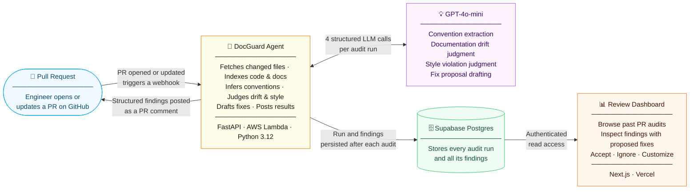

# DocGuard

> An AI agent that watches every GitHub PR and flags documentation drift and style violations before they reach main — automatically, with zero configuration.

---

## The Problem

Every engineering team fights the same two slow-moving fires:

**Documentation lies.** A function gets renamed, a signature changes, an example goes stale. The docs say one thing, the code does another. New engineers and API consumers get burned. Nobody has time to keep docs perfectly in sync on every PR.

**Style drifts silently.** Conventions exist informally — in senior engineers' heads — but new code violates them constantly. Code reviews waste 30–40% of their time on style. Consistency erodes as teams grow. There is no rulebook; there is only "ask someone who knows."

Existing tools address neither of these well. Linters check syntax, not whether docs match reality. Doc generators produce API references but ignore conceptual guides. Manual reviews are slow, inconsistent, and bottlenecked on your best engineers.

---

## What DocGuard Does

DocGuard installs as a **GitHub App**. When a pull request is opened or updated:

1. It fetches the changed `.py` and `.md` files at the PR's head SHA via the GitHub REST API
2. It builds a symbol index (Python AST) and a doc-section index (Markdown headings + code blocks) and links them together
3. It samples existing files to infer the codebase's conventions — no rulebook needed
4. It runs three LLM judgment passes with structured Pydantic output:
   - **Drift Judge** — identifies doc sections that describe symbols that changed
   - **Style Judge** — flags new code that violates inferred conventions
   - **Fix Drafter** — proposes a concrete fix for each finding
5. It posts a grouped, severity-sorted Markdown comment on the PR
6. It persists every run and finding to Supabase and surfaces them in a Next.js dashboard

The result: every PR gets a structured second opinion on docs and style, with zero reviewer effort.

---

## Architecture



---

## Key Design Decisions

**No clone, no local execution.** The agent fetches only the specific files it needs from the GitHub REST API at the PR's `head_sha`. This keeps Lambda cold-start times low and avoids the complexity of managing a git working tree in a serverless environment.

**LLM-inferred conventions.** Rather than requiring teams to maintain a rulebook, DocGuard samples representative files from the repo and asks the LLM to infer conventions. The same prompt runs on every audit, so convention drift is detected relative to the current state of the codebase — not a static snapshot from months ago.

**Structured LLM output only.** Every LLM call uses `beta.chat.completions.parse` with a Pydantic schema. There is no free-text parsing anywhere in the pipeline. If the LLM can't conform to the schema, the call fails hard rather than silently producing garbage findings.

**Separation of judgment and drafting.** The Drift Judge and Style Judge only identify *what* is wrong and *why*. The Fix Drafter runs as a second pass for each confirmed finding. This keeps prompts focused and makes it easy to swap or tune judge models independently.

**Single Lambda, background dispatch.** The webhook handler returns `202 Accepted` immediately and runs the full pipeline as a FastAPI `BackgroundTask` within the same Lambda invocation. No SQS queue, no worker Lambda — simple by default, with dispatch mode switchable via env var when scale demands it.

---

## Stack

| Layer | Technology | Hosting |
|---|---|---|
| Backend API | Python 3.12, FastAPI, Mangum | AWS Lambda |
| Infrastructure | Terraform | AWS API Gateway, CloudWatch |
| Database | PostgreSQL, SQLAlchemy 2 async, Alembic | Supabase |
| Auth | Supabase Auth (JWT) | Supabase |
| Frontend | Next.js 15, TypeScript, shadcn/ui | Vercel |
| LLM | OpenAI GPT-4o-mini | OpenAI / OpenRouter |
| Observability | structlog → CloudWatch, Langfuse | AWS + Langfuse Cloud |
| CI | GitHub Actions (lint, typecheck, test, build) | GitHub |

---

## Cost Profile

Approximate costs per PR audit, based on GPT-4o-mini pricing ($0.15/1M input, $0.60/1M output tokens).

| Step | Est. tokens (in / out) | Est. cost |
|---|---|---|
| Convention extraction | 3,000 / 300 | $0.00063 |
| Drift judgment | 2,000 / 500 | $0.00060 |
| Style judgment | 2,000 / 500 | $0.00060 |
| Fix drafting (~3 findings avg) | 1,500 / 400 × 3 | $0.00099 |
| **Total per PR** | | **~$0.003** |

A 100-engineer team merging 5 PRs/day: ~$0.45/day — roughly **$14/month** in LLM costs. Lambda and API Gateway costs are negligible at this scale.

Exact per-run token counts and costs are logged to CloudWatch and visible in Langfuse under each run trace.

---

## Repo Layout

```
nest/
├── backend/         # Python FastAPI — Lambda handler, pipeline, adapters
│   ├── src/
│   │   ├── domain/       # Pydantic models, exceptions
│   │   ├── services/     # Orchestration + agent pipeline
│   │   ├── adapters/     # GitHub, LLM, and DB I/O
│   │   ├── repositories/ # SQLAlchemy async repositories
│   │   └── api/          # FastAPI routers + Mangum entry point
│   └── tests/
├── frontend/        # Next.js 15 dashboard
├── infra/           # Terraform (Lambda, API Gateway, CloudWatch)
└── tasks/           # Sprint board, progress log, lessons learned
```

---

## Running Locally

```bash
# 1. Copy and fill in secrets
cp backend/.env.example backend/.env

# 2. Install backend deps
cd backend && uv sync --extra dev

# 3. Start the API
uv run uvicorn src.main:app --reload

# 4. Start the frontend (separate terminal)
cd frontend && npm install && npm run dev
```

For webhook delivery during local development, forward GitHub webhooks with [smee.io](https://smee.io) or `gh webhook forward`.

---

## Observability

Every LLM call emits a structured JSON log event to CloudWatch:

```json
{
  "event": "llm.trace",
  "model": "gpt-4o-mini",
  "prompt_tokens": 2041,
  "completion_tokens": 487,
  "cost_usd": 0.000598,
  "latency_ms": 1842.5,
  "run_id": "3f2a1b..."
}
```

When `LANGFUSE_PUBLIC_KEY` and `LANGFUSE_SECRET_KEY` are set, each audit run becomes a trace in Langfuse with nested generations for `convention_extractor`, `drift_judge`, `style_judge`, and `fix_drafter` — giving full visibility into token usage, latency, and cost per agent per run.

---

## V1 Scope

| In V1 | Deferred |
|---|---|
| Python source files | TypeScript, Go, Rust |
| Markdown documentation | MDX, Notion, Confluence |
| GitHub only | GitLab, Bitbucket |
| PR-triggered audits | Scheduled sweeps |
| PR comment output | Auto-fix PRs |
| Single repo per user | Multi-repo dashboard |
| Email/password + OAuth | SSO / SAML |
